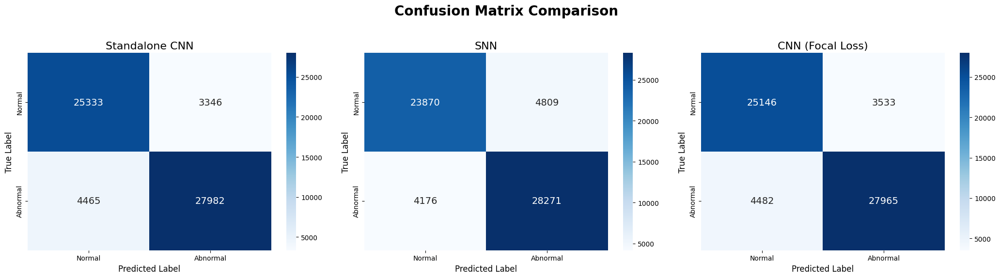
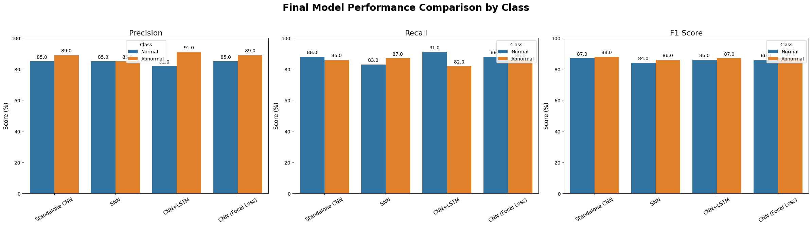

<div align="center">

# 💓 PulsePod
### A Robust Framework for Arrhythmia Detection using Deep and Spiking Neural Networks
**Deep Learning • Neuromorphic Computing • Real-Time Deployment**

[](https://www.python.org/)
[](https://pytorch.org/)
[](https://snntorch.readthedocs.io/)
[](https://streamlit.io/)
[]()

<p align="center">
  <a href="#-project-overview">Overview</a> •
  <a href="#-technical-specifications">Tech Specs</a> •
  <a href="#-architecture">Architecture</a> •
  <a href="#-installation">Installation</a> •
  <a href="#-performance--results">Results</a>
</p>
</div>

---

## 🩺 Project Overview
**PulsePod** is an end-to-end AI system designed to detect cardiac abnormalities from ECG signals with high reliability and efficiency. Unlike traditional models that fail when deployed on new patient populations (the **Dataset Shift** problem), PulsePod is built for **generalization**.


By training on a massive, unified dataset combining **MIT-BIH** and **PTB-XL** records , the system achieves robust performance across diverse demographics. It features a suite of models ranging from high-accuracy **1D-CNNs** to ultra-low-power **Spiking Neural Networks (SNNs)** designed for battery-constrained wearable devices

### 🌟 Key Features
* **🛡️ Robust Generalization:** Achieved **87% Accuracy** on the held-out **Unified Test Set** (61,126 samples), successfully generalizing across diverse signal sources.
* **🧠 Neuromorphic Intelligence:** Validated **SNNs** (Leaky Integrate-and-Fire) achieving **85% accuracy** on the unified dataset, demonstrating viability for energy-efficient edge hardware.
* **⚖️ Stratified Training:** Models trained on **244,502 heartbeats** with balanced class distribution to prevent bias and overfitting.
* **🚀 Real-Time Dashboard:** Interactive Streamlit interface for visualizing live ECG inference and probability confidence.
---

## 🔬 Technical Specifications

The system was engineered and validated using rigorous quantitative benchmarks.

### 📊 Data Composition
* **Total Processed Heartbeats:** 305,628 (Train + Test)
* **Source Integration:**
    * **MIT-BIH:** 54,680 beats (Gold-standard arrhythmia annotations)
    * **PTB-XL:** 250,948 beats (Diverse 12-lead clinical data)
* **Preprocessing:** NeuroKit2 pipeline with **187-sample fixed window** segmentation

### 🧠 Model Architectures
**1. Deep CNN (Robust Classifier)**
* **Structure:** 2-Layer 1D-Convolutional Network with MaxPooling and Dropout (0.5)
* **Kernels:** 32 & 64 filters (Kernel Size=5) optimized for morphological feature extraction
* **Loss Function:** **Focal Loss** implemented to counter class imbalance

**2. Spiking Neural Network (Neuromorphic)**
* **Neuron Model:** Leaky Integrate-and-Fire (LIF) with surrogate gradient descent
* **Simulation:** **50 Time Steps** per inference window:
* **Decay Rate:** $\beta = 0.95$ (Optimized for membrane potential retention)

---

## 🏗 Architecture

The system follows a modular pipeline from raw signal ingestion to edge deployment.

```mermaid
graph LR
    A[Raw ECG Data] --> B(Preprocessing & Segmentation)
    B --> C{Unified Dataset Creation}
    C --> D[Training Loop]
    D --> E[Model Zoo]
    E --> F[Deployment Dashboard]

    subgraph Models
        E1[Standalone CNN]
        E2[SNN Neuromorphic]
        E3[CNN+LSTM]
    end

    E --> E1
    E --> E2
    E --> E3
````

-----

## ⚙️ Installation

To ensure environment stability, requirements are split into two categories.

### 1\. Clone the Repository

```bash
git clone https://github.com/Vishwanath-06/PulsePod.git
cd PulsePod
git lfs install
git lfs pull
```

### 2\. Set up the Environment

**Option A: For Standard CNN Models (Recommended)**
Use this for the main Dashboard and standard Deep Learning models.

```bash
# Create virtual environment
python -m venv venv_cnn
source venv_cnn/bin/activate  # or venv_cnn\Scripts\activate on Windows

# Install dependencies
pip install -r cnn_requirements.txt
```

**Option B: For Neuromorphic SNN Experiments**
Use this specifically for running Spiking Neural Networks.

```bash
# Create virtual environment
python -m venv venv_snn
source venv_snn/bin/activate  # or venv_snn\Scripts\activate on Windows

# Install dependencies
pip install -r snn_requirements.txt
```

-----

## 🚀 Usage

### 1\. Launch the Dashboard

Visualize the inference stream in a web interface.

```bash
# Ensure venv_cnn is active
streamlit run app.py
```

### 2\. Data Preprocessing (Optional)

The test data is already provided in `.npy` format in the `data/` folder. If you wish to regenerate the unified test set from raw sources:

```bash
python data/create_unified_test_set.py
```

-----

## 📊 Performance & Results

We evaluated our models on a held-out, multi-domain test set (Unified MIT-BIH + PTB-XL, **61,126 samples**) to ensure true robustness.

| Model Architecture | Accuracy | Precision (Abnormal) | Recall (Abnormal) | F1-Score | Use Case |
| :--- | :---: | :---: | :---: | :---: | :--- |
| **Robust CNN** | **87%** | **0.89** | 0.86 | **0.88** | Best Overall Balance |
| **Spiking NN (SNN)** | 85% | 0.85 | **0.87** | 0.86 | Ultra-Low Power / High Recall |
| **CNN + LSTM** | 75%* | 0.95 | 0.58 | 0.72 | Precision / Specificity |

*> **Note:** While CNN-LSTM performed well on clean data, the standalone CNN demonstrated superior generalization on the heterogeneous PTB-XL test set (82% vs 75%).*

### 📈 Detailed Evaluation
The confusion matrices below demonstrate the Robust CNN's ability to minimize False Negatives (critical for healthcare), while the metrics comparison highlights the SNN's competitive performance despite being energy-efficient.

**Confusion Matrices (Generalization Test)**


**Model-wise Metrics Comparison**

-----

## 📂 Project Structure

```text
PulsePod/
├── data/                           # Processed .npy datasets & Scripts
│   ├── mit_bih/
│   ├── ptb_xl/
│   ├── unified_test_set/
│   └── create_unified_test_set.py  # Script to merge datasets
├── models/                         # Pre-trained PyTorch models
│   ├── final_robust_cnn.pt
│   ├── final_robust_cnn_focal_loss.pt
│   ├── final_robust_cnn_lstm.pt
│   └── final_robust_snn.pt
├── app.py                          # Main Streamlit Dashboard
├── cnn_requirements.txt            # Standard dependencies
├── snn_requirements.txt            # SNN dependencies
└── readme.md
```

-----

## 🔮 Future Scope

  * **Hardware Porting:** Deploy SNN models to Intel Loihi or Neuromorphic chips.
  * **Multi-Class:** Extend detection to specific arrhythmias (AFib, PVC, LBBB).
  * **Federated Learning:** Implement privacy-preserving patient data training.

<div align="center">Built with 💙 by Vishwanath.T</div>
